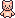

<p align="center">
  
</p>

# Andrea's 2D Portfolio

Un portfolio interattivo realizzato in Svelte con l'aiuto di GSAP, ispirato ai videogiochi 2D.

## Caratteristiche

-   Mappa fullscreen e responsive
-   Player animato con movimento tramite tastiera e touch (joystick virtuale)
-   Punti di interesse (POI) interattivi con animazioni
-   Overlay ENTER animato per interazione
-   Supporto mobile completo
-   Stile personalizzato con font custom

## Avvio rapido

1. Installa le dipendenze:
    ```bash
    npm install
    ```
2. Avvia il progetto:
    ```bash
    npm run dev
    ```
3. Apri [http://localhost:5173](http://localhost:5173) nel browser

## Assets

Tutti gli asset (sprite, font, immagini) sono nella cartella `src/assets/`.

## Credits

-   **Font**: [Pixel Parchment by Denizen Games](https://denizen-games.itch.io/pixel-parchment-font)
-   **Personaggino & Logo**: [Paws & Whiskers Isometric Cats Pack by netherzapdos](https://netherzapdos.itch.io/paws-whiskers-isometric-cats-pack)
-   **PC**: [Evil PC by hikkihuy](https://hikkihuy.itch.io/evil-pc)

---

Made with ❤️ by Andrea Bellu
